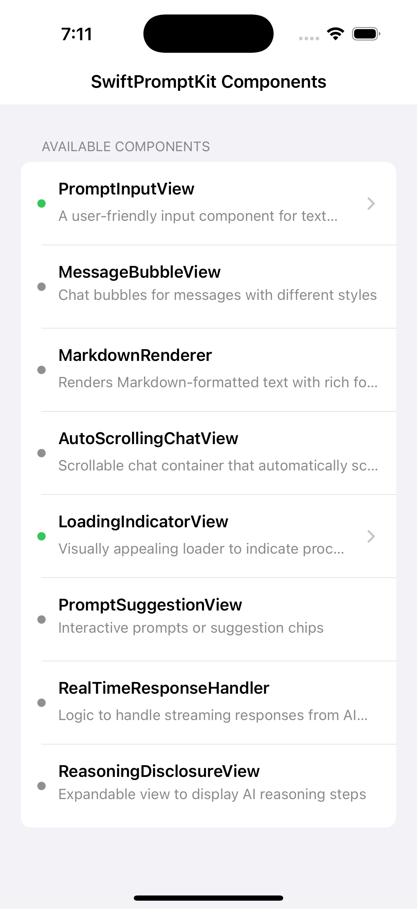
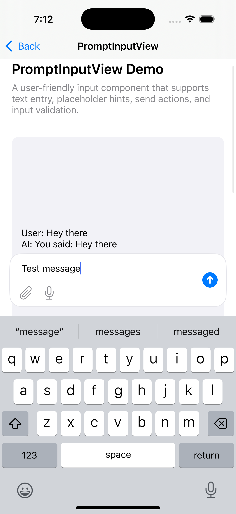
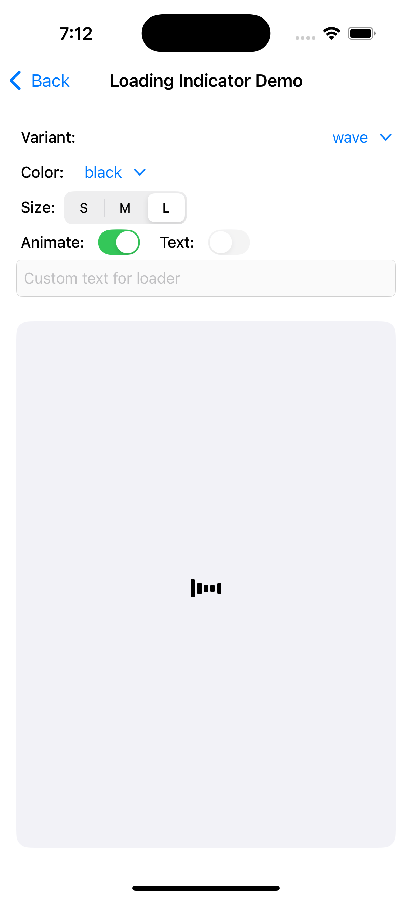

# SwiftPromptKit

SwiftPromptKit is a modern, modular UIKit component library specifically designed for building AI-driven chat interfaces in iOS applications. Inspired by [Prompt-Kit](https://www.prompt-kit.com/), it provides ready-to-use UI components to quickly build beautiful, interactive AI chat experiences.

## Screenshots

<p align="center">
  
  
  
</p>

## Features

- 🧩 **Modular Components**: Each component is designed to be used independently or together to build complete chat experiences
- 🎨 **Customizable**: Easily adapt the look and feel to match your app's design system
- 📱 **iOS-Native**: Built with UIKit for optimal performance and familiar integration in iOS apps
- ♿️ **Accessibility**: Components support VoiceOver and other accessibility features
- 🚀 **Demo App**: Includes an interactive demo app showcasing all components

## Components

SwiftPromptKit includes the following components:

| Component | Status | Description |
|-----------|--------|-------------|
| PromptInputView | ✅ Implemented | A user-friendly input component for text entry |
| LoadingIndicatorView | ✅ Implemented | Visually appealing loader to indicate processing |
| MessageBubbleView | 🔄 Planned | Chat bubbles for messages with different styles |
| MarkdownRenderer | 🔄 Planned | Renders Markdown-formatted text with rich formatting |
| AutoScrollingChatView | 🔄 Planned | Scrollable chat container that automatically scrolls to latest messages |
| PromptSuggestionView | 🔄 Planned | Interactive prompts or suggestion chips |
| RealTimeResponseHandler | 🔄 Planned | Logic to handle streaming responses from AI models |
| ReasoningDisclosureView | 🔄 Planned | Expandable view to display AI reasoning steps |

## Requirements

- iOS 14.0+
- Swift 5.5+
- Xcode 13.0+

## Installation

### Swift Package Manager

Add the following to your `Package.swift` file:

```swift
dependencies: [
    .package(url: "https://github.com/nuxe/SwiftPromptKit.git", from: "0.1.0")
]
```

### Manual Installation

1. Clone this repository
2. Drag and drop the `SwiftPromptKit` folder into your Xcode project
3. Make sure to check "Copy items if needed" and select your target

## Usage

### PromptInputView


```swift
// Create the input view
let promptInputView = PromptInputView()
promptInputView.translatesAutoresizingMaskIntoConstraints = false
promptInputView.placeholder = "Ask me anything..."
promptInputView.delegate = self

// Add to your view
view.addSubview(promptInputView)

// Set up constraints
NSLayoutConstraint.activate([
    promptInputView.leadingAnchor.constraint(equalTo: view.leadingAnchor, constant: 16),
    promptInputView.trailingAnchor.constraint(equalTo: view.trailingAnchor, constant: -16),
    promptInputView.bottomAnchor.constraint(equalTo: view.keyboardLayoutGuide.topAnchor, constant: -16)
])

// Implement the delegate
extension YourViewController: PromptInputViewDelegate {
    func promptInputView(_ inputView: PromptInputView, didSubmitText text: String) {
        // Handle submitted text
        print("User submitted: \(text)")
    }
    
    func promptInputView(_ inputView: PromptInputView, didChangeText text: String) {
        // Optional: handle text changes
    }
}
```

### LoadingIndicatorView


```swift
// Create the loading indicator
let loadingIndicator = LoadingIndicatorView()
loadingIndicator.translatesAutoresizingMaskIntoConstraints = false
loadingIndicator.style = .dots // Options: .dots, .pulse, .typingIndicator
loadingIndicator.color = .systemBlue

// Add to your view
view.addSubview(loadingIndicator)

// Set up constraints
NSLayoutConstraint.activate([
    loadingIndicator.centerXAnchor.constraint(equalTo: view.centerXAnchor),
    loadingIndicator.centerYAnchor.constraint(equalTo: view.centerYAnchor),
    loadingIndicator.widthAnchor.constraint(equalToConstant: 80),
    loadingIndicator.heightAnchor.constraint(equalToConstant: 40)
])

// Start the animation
loadingIndicator.startAnimating()

// Later, stop the animation
loadingIndicator.stopAnimating()
```

## Demo App


SwiftPromptKit includes a demo app that showcases all available components and their customization options. To run the demo app:

1. Clone this repository
2. Open `SwiftPromptKit.xcodeproj` in Xcode
3. Select the `SwiftPromptKit` scheme
4. Run the project on a simulator or device

## Customization

Most components support customization through properties and delegate methods. See individual component documentation for details.

## Contribution
Contributions are welcome! 

Please make sure to update tests as appropriate.

## License

This project is licensed under the MIT License - see the LICENSE file for details.

## Acknowledgements

- [Prompt-Kit](https://www.prompt-kit.com/) - The original TypeScript library that inspired this project
